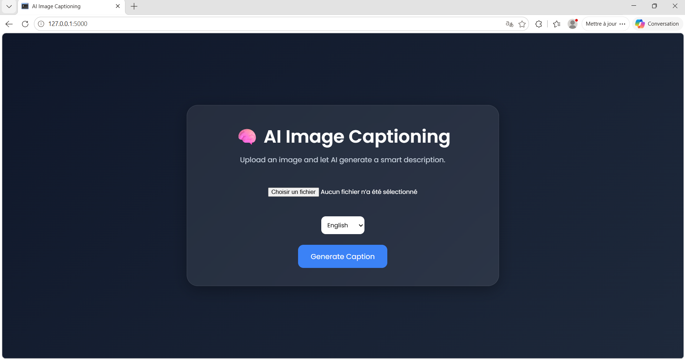
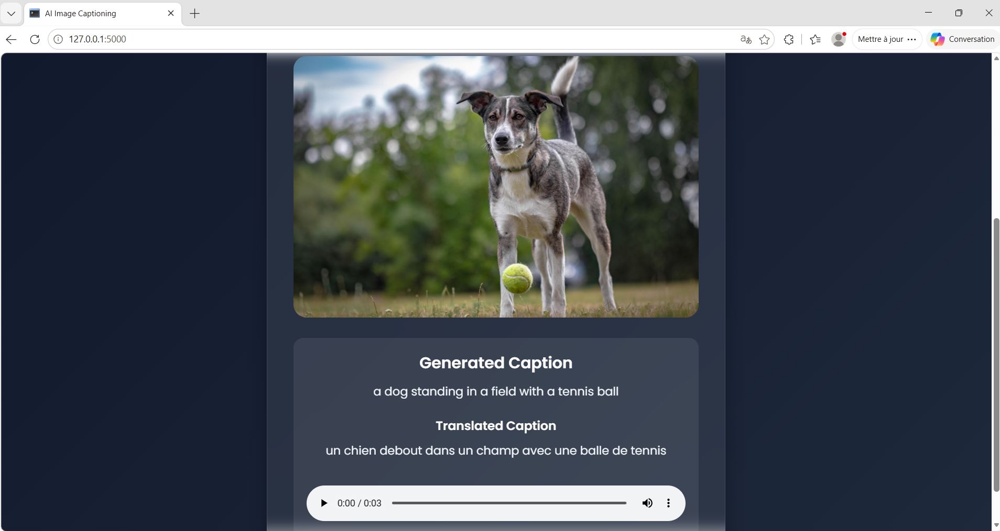
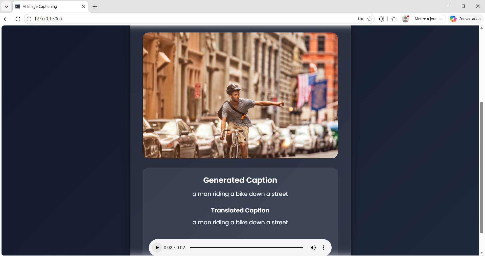

# AI Image Captioning Web Application

---

## Description

This project is a Generative AI web application that automatically generates meaningful captions for images using a Transformer-based deep learning model (BLIP).

The system allows users to:

- Upload an image
- Generate an AI-based description
- Translate the caption into multiple languages
- Convert the caption into speech (audio)

---

## Features

- Image upload via web interface
- AI-generated image captions using Transformer model
- Automatic translation (EN / FR / AR)
- Text-to-Speech audio generation
- Modern responsive UI

---

## AI Model Used

We use the **BLIP (Bootstrapped Language Image Pretraining)** model:

- Model: `Salesforce/blip-image-captioning-base`
- Type: Vision-Language Transformer
- Framework: HuggingFace Transformers

---

## Technologies Used

- Python
- Flask
- PyTorch
- Transformers
- HTML / CSS
- Deep Translator
- gTTS

---

## Project Structure

```
AI-Image-Captioning/
│
├── app.py
├── requirements.txt
│
├── model/
│   └── caption_generator.py
│
├── static/
│   ├── uploads/
│   ├── audio/
│   └── style.css
│
├── templates/
│   └── index.html
│
└── screenshots/
```

---

## How to Run

```bash
pip install -r requirements.txt
python app.py
```

Then open:

```
http://127.0.0.1:5000
```

---

## Screenshots

### Home Page



### Generated Caption





---

## Demo Video

Watch demo:
https://drive.google.com/file/d/1al2gd4E7Diu9Zp3YTJ04Mo9HjFASmFpW/view?usp=sharing

---

## Author

- Amira Behi Sefi (2 DAD)

---

## Future Improvements

- Add BLIP-2 or GPT-4V integration
- Improve UI with React
- Deploy on cloud (Render / HuggingFace Spaces)
- Add multiple caption generation

---

## Conclusion

This project demonstrates how Computer Vision and Generative AI can be combined to build real-world intelligent applications.
